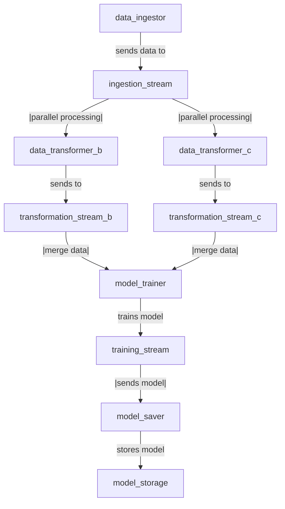

Epic: # **Design and Implement Streamgale Topology  Workflow Descriptor in YAML**

## **Description**

Design a **Topology Workflow Descriptor** in **YAML format** to define the structure and interactions between different components in **Streamgale**. The descriptor should include:

- Different **Blot types**:
  - **Docklet**
  - **Actor** (Includes invocation URI and factory name)
  - **Tasklet** (Includes invocation URI and factory name)
- **Connectors (Sprouts)** for communication, supporting:
  - **Kafka**
  - **ELK**
  - **NATS**
  - **Cassandra**
  - **MongoDB**
- **Factory Methods** to instantiate topologies.
- **Secret references** as URIs instead of raw values.

## **Requirements**

### **1. Topology Workflow Structure in YAML**
- Define different **Blot types**:
  - **Docklet**: Represents a standalone execution unit.
  - **Actor**: Includes an **invocation URI** and a **factory name** for instantiation.
  - **Tasklet**: Includes an **invocation URI** and a **factory name** for instantiation.
- Each **topology** should have a **factory method** to instantiate components dynamically.

### **2. Connectors (Sprouts)**
- Support different **message brokers and storage systems**:
  - **Kafka**
  - **ELK**
  - **NATS**
  - **Cassandra**
  - **MongoDB**
- Define each **sprout** with the appropriate **configuration parameters**.

### **3. Security Handling**
- Secrets should be referenced as **URIs** instead of raw values.
- Ensure the descriptor does not expose sensitive information.

## **Acceptance Criteria**
- The YAML descriptor should correctly represent a **workflow topology** with:
  - **Docklet, Actor, Tasklet, and Connectors**.
  - **Invocation URIs and Factory names** for Actors and Tasklets.
  - **A Factory Method** to instantiate the topology.
- **Connectors (Sprouts) should be configurable** with Kafka, ELK, NATS, Cassandra, and MongoDB.
- **Secrets must be referenced as URIs** instead of plaintext values.
- The descriptor should be **well-structured and validated**.

---
### **Potential Topology example**:

```yaml
topology:
  factory_method: "my_pipeline_topology_factory"
  components:
    - type: "docklet"
      name: "data_ingestor"
      uri: "http://docklet-service/ingest"
      factory: "docklet_factory"
    - type: "actor"
      name: "data_transformer_b"
      uri: "http://actor-service/transform-b"
      factory: "actor_factory"
    - type: "actor"
      name: "data_transformer_c"
      uri: "http://actor-service/transform-c"
      factory: "actor_factory"
    - type: "actor"
      name: "model_trainer"
      uri: "http://actor-service/train"
      factory: "actor_factory"
    - type: "tasklet"
      name: "model_saver"
      uri: "http://tasklet-service/save"
      factory: "tasklet_factory"
  sprouts:
    - type: "kafka"
      name: "ingestion_stream"
      config:
        brokers: "kafka://broker-uri"
    - type: "nats"
      name: "transformation_stream_b"
      config:
        server: "nats://nats-uri"
    - type: "nats"
      name: "transformation_stream_c"
      config:
        server: "nats://nats-uri"
    - type: "kafka"
      name: "training_stream"
      config:
        brokers: "kafka://broker-uri"
    - type: "mongodb"
      name: "model_storage"
      config:
        connection_uri: "secret://mongo-uri"
connections:
  - data_ingestor >> ingestion_stream
  - ingestion_stream << [data_transformer_b, data_transformer_c]
  - data_transformer_b >> transformation_stream_b
  - data_transformer_c >>  transformation_stream_c
  - [transformation_stream_b, transformation_stream_c] << model_trainer
  - model_trainer >> training_stream
  - training_stream << model_saver
  - model_saver >> model_storage
secrets:
  - name: "mongo-uri"
    uri: "vault://path/to/mongo/secret"
```
