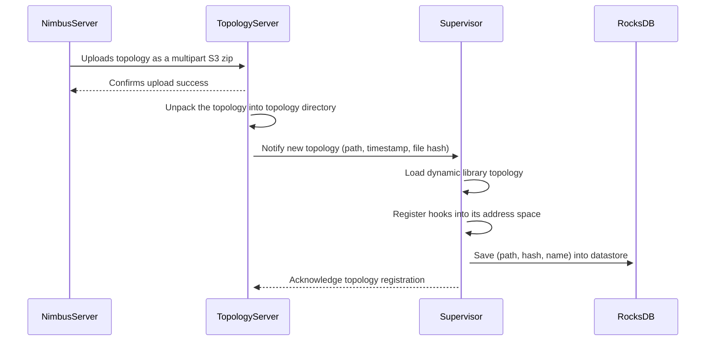

# 📜 Supervisor Design

## 🔹 Overview
This document describes the process of **uploading, unpacking, and registering a topology** in the **Supervisor System**. The process involves interactions between the **Nimbus Server, Topology Server, and Supervisor**.

## 🔄 Sequence Flow

## ��️ **Process Steps**

1. **Nimbus Server Uploads Topology**  
   - The **Nimbus Server** uploads a **topology zip file** to the **Topology Server** using an **S3 multipart upload** interface.
   - The **Topology Server** confirms the successful upload.

2. **Topology Server Processes the Upload**  
   - **Unpacks** the topology into the **topology directory**.
   - **Notifies** the **Supervisor** that a **new topology** is ready, providing:  
     - The **topology path**  
     - The **timestamp**  
     - The **file hash**  

3. **Supervisor Loads the Topology**  
   - Dynamically **loads** the topology as a shared library (`.so` or `.dll`).
   - Registers the **hooks** into its own **address space**.

4. **Supervisor Stores Topology Metadata**  
   - Saves the topology **path, hash, and name** in **RocksDB** for persistence.

5. **Final Acknowledgment**  
   - The **Supervisor acknowledges** the successful registration to the **Topology Server**.

## 📌 Summary
- **Nimbus Server** uploads the topology via S3.
- **Topology Server** extracts and forwards metadata to the **Supervisor**.
- **Supervisor** dynamically loads and registers the topology.
- **Metadata** is persisted in **RocksDB** for reference.

---

### 🚀 **This ensures a smooth, dynamic topology integration process in the Supervisor System.**

